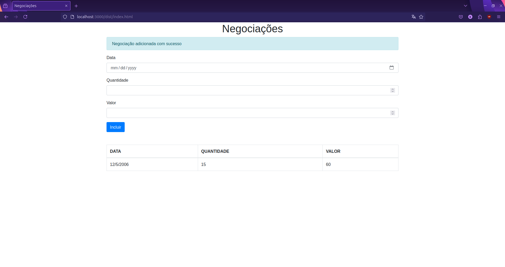

# Página de Negociação na Bolsa de Valores

Bem-vindo ao projeto de criação de uma página de negociação na bolsa de valores. Este projeto foi desenvolvido com o objetivo de aprender e demonstrar as capacidades do **TypeScript** na construção de aplicações web robustas e escaláveis.

## Funcionalidades

- **Operações Restritas a Dias Úteis:** As operações de compra e venda só podem ser realizadas em dias úteis, respeitando o horário de funcionamento do mercado.
- **Monitoramento de Desempenho:** O sistema monitora o tempo de execução de cada função, garantindo que a aplicação permaneça rápida e responsiva.
- **Interface Intuitiva:** Design limpo e amigável para facilitar a navegação.

## Por que TypeScript?

**TypeScript** é uma linguagem de programação open-source desenvolvida pela Microsoft que estende o JavaScript, adicionando tipagem estática e outros recursos avançados. Aqui estão algumas razões pelas quais o uso do **TypeScript** é benéfico:

- **Detecção Precoce de Erros:** Com a tipagem estática, muitos erros comuns são identificados durante o desenvolvimento, antes mesmo da execução.
- **Melhor Manutenibilidade:** O código tipado é mais fácil de entender e refatorar, tornando a manutenção do projeto mais simples.
- **Suporte a Novos Recursos:** **TypeScript** suporta funcionalidades modernas do JavaScript e permite o uso de recursos que ainda não são amplamente suportados nos navegadores.
- **Comunidade Ativa:** Com uma comunidade crescente, há uma abundância de recursos, bibliotecas e ferramentas disponíveis.

Aprender **TypeScript** não só melhora suas habilidades de desenvolvimento front-end, mas também prepara você para construir aplicações mais confiáveis e eficientes.
